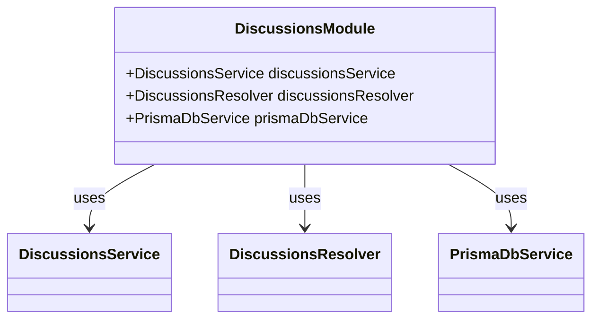
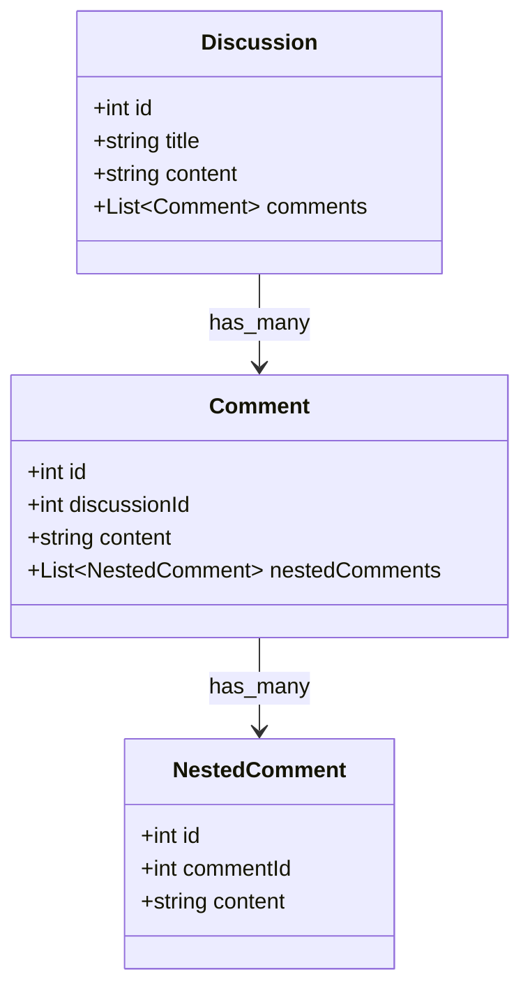
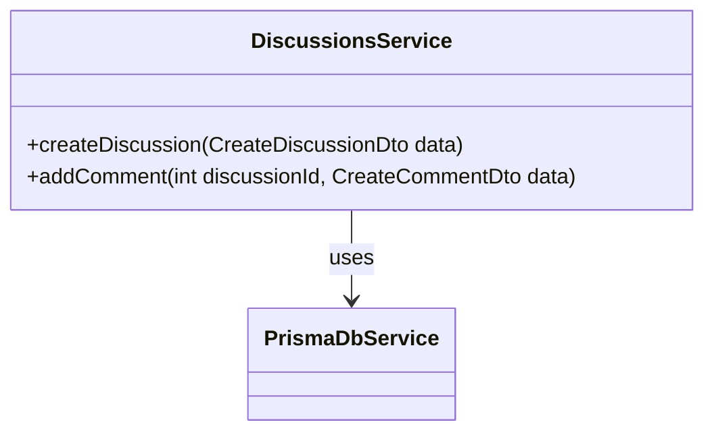
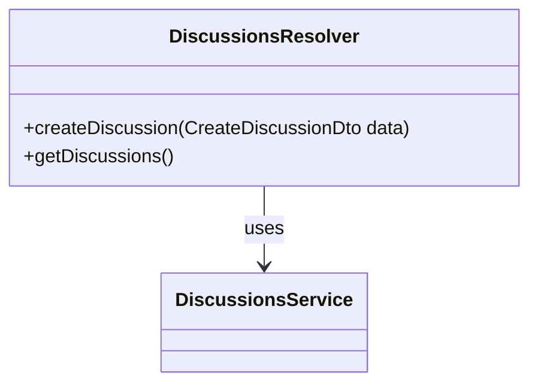
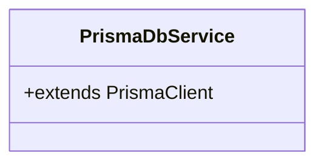
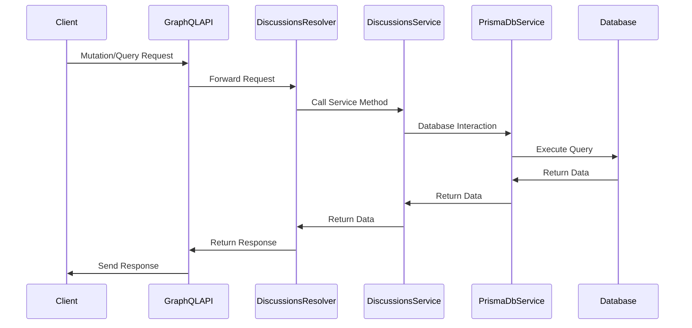

  

---

### **Overview**

This project is a NestJS-based application that uses Prisma for database interactions, GraphQL for API implementation, and DTOs for data validation and transformation. The main focus is on managing discussions, comments, and nested comments within a discussion forum.

### **Main Application Structure**

The application is structured with various modules, services, and resolvers that handle specific tasks within the application.

---

### **Module Structure**

#### **Discussions Module**

The `DiscussionsModule` organizes related components, including services and resolvers, into a cohesive unit.

- **DiscussionsModule**: Manages discussions, comments, and nested comments.
- **Dependencies**: `DiscussionsService`, `DiscussionsResolver`, `PrismaDbService`.

---

### **Entities**

Entities represent the structure of the data managed by the application. 

- **Discussion**: Represents a discussion with title and content, and contains multiple comments.
- **Comment**: Represents a comment, which is linked to a discussion and can have nested comments.
- **NestedComment**: Represents a comment that is nested under another comment.

---

### **Service Layer**

The `DiscussionsService` handles the business logic and interacts with the database to manage discussions and comments.

- **DiscussionsService**: Contains methods to create discussions and add comments, interacting with the database through `PrismaDbService`.

---

### **GraphQL Resolver**

The `DiscussionsResolver` maps GraphQL queries and mutations to the corresponding service methods, enabling interaction with the API.

- **DiscussionsResolver**: Defines GraphQL mutations and queries, linking them to the appropriate service methods.

---

### **Prisma Service**

The `PrismaDbService` manages all database interactions using Prisma ORM, extending the `PrismaClient`.

- **PrismaDbService**: Extends `PrismaClient` to enable all database operations within the application.

---

### **Data Flow**

Below is a visual representation of the data flow within the application, starting from the API request, going through the resolver, service, and finally interacting with the database.

- **Client**: Initiates a request through the GraphQL API.
- **GraphQLAPI**: Receives the request and forwards it to the resolver.
- **DiscussionsResolver**: Calls the service methods based on the request.
- **DiscussionsService**: Handles the logic and interacts with the database through `PrismaDbService`.
- **PrismaDbService**: Executes the database query and returns the data.
- **Database**: Stores the data and processes the queries.
- **Client**: Receives the final response.

---

## License

Nest is [MIT licensed](LICENSE).
